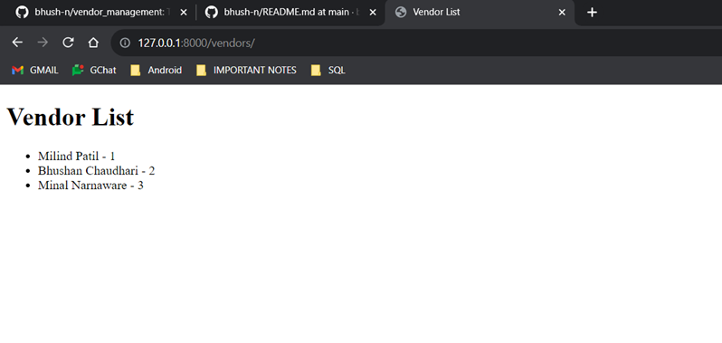
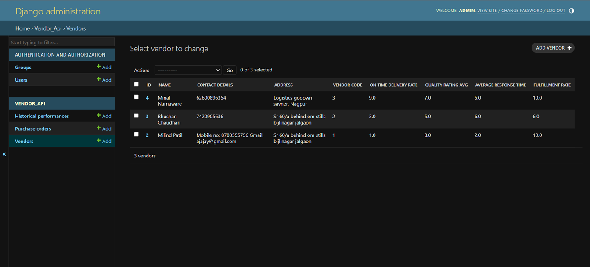
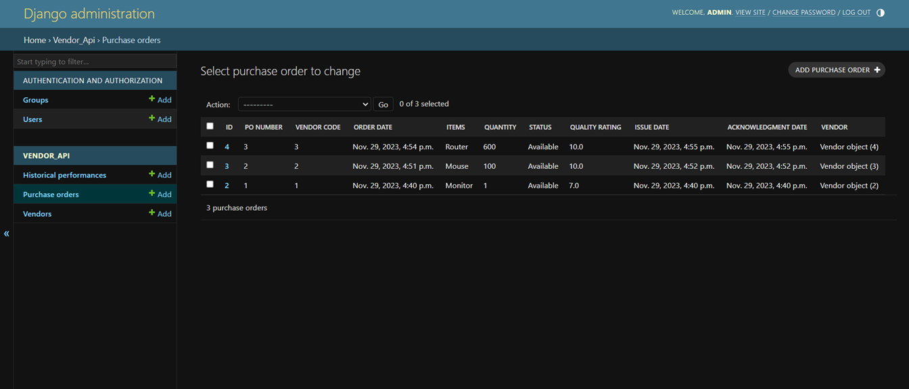
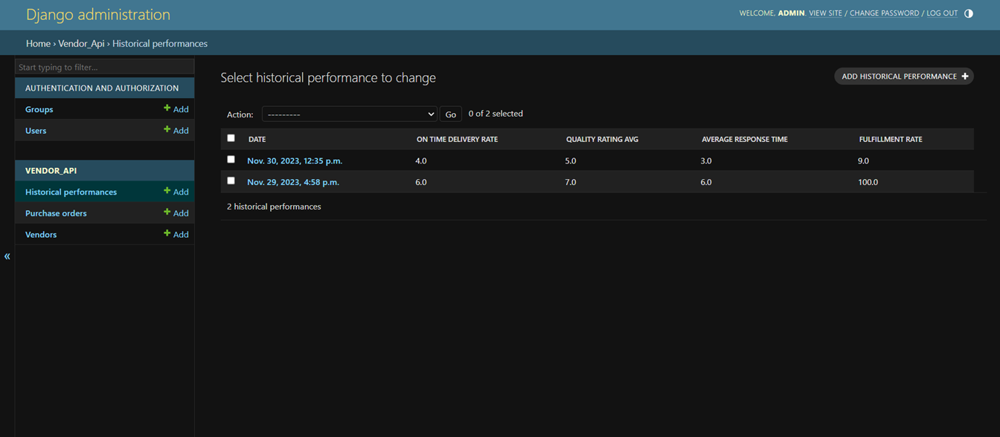

# Vendor Management System

## Table of contents

[Introduction](https://github.com/bhush-n/vendor_management#introduction)

[Roadmap](https://github.com/bhush-n/vendor_management#roadmap)

[Features](https://github.com/bhush-n/vendor_management#features)

[API References](https://github.com/bhush-n/vendor_management#api-reference)

[Tech Stack](https://github.com/bhush-n/vendor_management#tech-stack)

[Installation](https://github.com/bhush-n/vendor_management#installation)

[Deployment](https://github.com/bhush-n/vendor_management#deployment)

[Screenshots](https://github.com/bhush-n/vendor_management#screenshots)

[Author/Company](https://github.com/bhush-n/vendor_management#assignement-by)

[FAQ](https://github.com/bhush-n/vendor_management#faq)

[Support](https://github.com/bhush-n/vendor_management#support)

## Introduction

The Vendor Management System, developed using Django, is a web application designed for streamlined vendor relationship management. 

It encompasses functionalities for managing vendor profiles, tracking purchase orders, and evaluating vendor performance. 

Users can create, update, and delete vendor profiles, monitor purchase orders, and assess vendor performance metrics such as on-time delivery rate, quality rating average, average response time, and fulfillment rate. 


## Roadmap

- __Start and Plan:__ Understand the project scope and set up the basic structure.

- __Vendor Setup:__ Create a system to manage vendor information and test it.

- __Purchase Order Management:__ Develop purchase order forms and check their functionality.

- __Performance Evaluation:__ Add a scoring system for vendors and calculate scores dynamically.

- __Historical Tracking:__ Include a history feature to track vendor performance over time.

- __Testing Phase:__ Conduct thorough testing, find and fix bugs.

- __Deployment:__ Put the system online for use.

- __Maintenance:__ Keep an eye on the system, fix issues, and assist users.

## Features

- User/Admin can add or remove vendors 
- Vendors can see the list of different members
- Admin can give the perfect calculations for performance
- Easy to use
- API endpoints can be checked using Django ORM
- No need of any tools is needed for API endpoints checking.


## API Reference

#### Vendor Profile Management:

```http
  POST /api/vendors/: Create a new vendor.
  GET /api/vendors/: List all vendors.
  GET /api/vendors/{vendor_id}/: Retrieve a specific vendor's details.
  PUT /api/vendors/{vendor_id}/: Update a vendor's details.
  DELETE /api/vendors/{vendor_id}/: Delete a vendor.
```


#### Purchase Order Tracking:

```http
  POST /api/purchase_orders/: Create a purchase order.
  GET /api/purchase_orders/: List all purchase orders with an option to filter by vendor.
  GET /api/purchase_orders/{po_id}/: Retrieve details of a specific purchase order.
  PUT /api/purchase_orders/{po_id}/: Update a purchase order.
  DELETE /api/purchase_orders/{po_id}/: Delete a purchase order.
```


#### Historical Performance:

```http
  GET /api/vendors/{vendor_id}/performance
```

## Tech Stack

**Stack:** Python, Django, dbsqlite3

**Server:** localhost:8000


## Installation

```bash
python -m venv venv

source venv/Scripts/activate

pip install django

pip install djangorestframework

pip install -r requirements.txt

python manage.py makemigrations 

python manage.py migrate

python manage.py createsuperuser 

python manage.py runserver

http://localhost:8000/vendors/  --for vendor list

http://localhost:8000/admin  --for admin
```
## Deployment

To deploy this project on git

```bash
 ($ pip freeze > requirements.txt)  ### It will freeze all the requirements in one txt file ###

 ($ git init)   ### It will initialize the folder as a local Git repository ###

 ($ git status)   ### This command to check if there are any changes to your Django code that need to be pushed to git ###

 ($ git add -A)   ### The -A flag is for all. It is used for adding all the commits to a repository ###

 ($ git commit -m "initial commit") ### It is for passing the message to repository ###

  ### Create A New Github Repository ###
  - Click the ‘+’ dropdown at the top right corner of your GitHub dashboard and click on the ‘New Repository’ option.
  - Type the name of the Repository. It is best practice to give it the same name as that of your Django project.
  - Give a description of the project if you wish to do so.
  - Choose if it is going to be a Private or Public directory.
  - The next step ‘Initialize your project with:’ is optional, skip it if you wish to.
  ### Click the ‘Create Reposity’ button ###

 ($ git remote add origin https://github.com/bhush-n/vendor_management.git)  ### It will add a new remote origin ###

 ($ git branch -M main)  ### It is used to shift to the main branch from master ###

 ($ git push -u origin main)  ### It will push your code the remote repository which you have added recently ###


```


## Screenshots

__Simple HTML page for Vendor List__\



__Vendor List API Endpoint__



__Purchase Order API Endpoint__



__Historical Performance API Endpoint__



## ASSIGNEMENT BY

This project is assisgned by the following company:

- [FATMUG, Delhi, India](https://www.linkedin.com/company/fatmug-designs/)


## FAQ

#### 1) I am getting the problem in database migration?

First of all check all your databases if the db file has been created or not.
Still if the problem pursuits, go to migration files and delete all the migrations files without __init__.py.
Remigrate the database and it should be solved now.

__How to check the database__

 Run the following commands in bash.
- python manage.py dbshell
- .table

___

#### 2) Api endpoints are not visible on cmd, What should I do?

Api endpoints can only be checked by the tools like __POSTMAN__ or you can check it using __DJANGO_ORM__.

For using Django-ORM, You have to register for the admin in project using
 - python manage.py createsuperuser

Then you have to create the admin pages for all the API endpoints models in admin.py file.

After successfully completing all this steps, You can now check your endpoints without any error.

___
#### 3) I am unable to load the localhost server on web?

If your server is not running by following IP: http://127.0.0.1:8000/vendors/ or http://localhost:8000/vendors/, It might happen beacause of unproper url paths. 

Recheck your urls.py in app if it correctly given or not.

___

#### 4) I have successfully installed djangorestframework but still it is giving error for it is not defined, what should i do?

It might happen almost because of only one mistake you do, Which is not installing the appname or library name in __INSTALLED APP__ setting present in settings.py file of main project.

___

```http
- If you have more questions you can drop a mail on :
```
bhushanch45@gmail.com
___
## Support

For support, email bhushanch45@gmail.com

